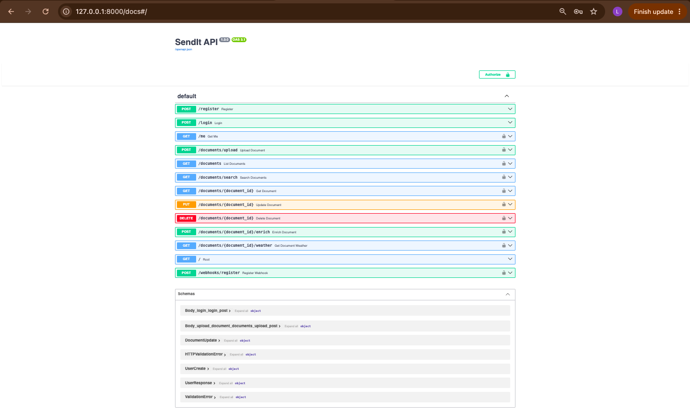

# SendIt – Document Management API

**Student Name:** Loise Maina
**Admission Number:** C027-01-0852/2024


## 1. Project Description

SendIt is a document management API developed using FastAPI. It allows a courier company to digitally upload, manage, search and enrich documents with weather information for specified locations.

The API provides secure access using authentication and role-based authorization.

## 2. Technologies Used

* Python
* FastAPI
* SQLModel
* PostgreSQL
* Docker
* JWT Authentication
* Open-Meteo Weather API
* SlowAPI for rate limiting
* Uvicorn

## 3. Main Features

* User registration and login
* JWT-based authentication
* Role-based access for admin, manager and staff
* Document upload
* File type and file size validation
* Document versioning
* Document search and filtering
* Document update and deletion
* Weather data enrichment using Open-Meteo
* Manual weather enrichment
* Document status tracking
* Webhook registration
* API rate limiting

## 4. Project Structure

```text
sendit-api/
├── main.py
├── models/
│   ├── __init__.py
│   ├── user.py
│   └── document.py
├── database/
│   ├── __init__.py
│   └── session.py
├── services/
│   ├── __init__.py
│   └── weather.py
├── uploads/
├── screenshots/
│   └── sendit-api-screenshot.png
├── auth.py
├── seeds.py
├── .env
├── docker-compose.yml
├── alembic.ini
├── pyproject.toml
└── README.md
```

## 5. API Endpoints

| Method | Endpoint                           | Description                      |
| ------ | ---------------------------------- | -------------------------------- |
| POST   | `/register`                        | Register a new user              |
| POST   | `/login`                           | Login and obtain an access token |
| GET    | `/me`                              | Get current user                 |
| POST   | `/documents/upload`                | Upload a document                |
| GET    | `/documents`                       | List documents                   |
| GET    | `/documents/search`                | Search documents using filters   |
| GET    | `/documents/{document_id}`         | Get one document                 |
| PUT    | `/documents/{document_id}`         | Update a document                |
| DELETE | `/documents/{document_id}`         | Delete a document                |
| POST   | `/documents/{document_id}/enrich`  | Manually enrich a document       |
| GET    | `/documents/{document_id}/weather` | Get weather information          |
| POST   | `/webhooks/register`               | Register a webhook               |

## 6. File Upload Validation

The API accepts the following file types:

* PDF
* JPG
* JPEG
* PNG
* DOCX

The maximum upload size is **5 MB**.

Uploaded files are stored in the `uploads/` directory and a corresponding document record is stored in PostgreSQL.

## 7. Document Status

Documents can have different statuses during processing:

* `processing` – document is being processed
* `uploaded` – document has been uploaded successfully
* `enriched` – weather information has been successfully added
* `failed` – enrichment failed

## 8. Weather API Integration

SendIt uses the **Open-Meteo API** to obtain weather information based on the city and country provided during document upload.

The weather information is stored together with the document and can also be retrieved using the weather endpoint.

## 9. Role-Based Access

The API uses three user roles:

* **Admin:** Has full administrative access.
* **Manager:** Can manage and delete documents and perform enrichment.
* **Staff:** Can access and manage their own documents.

Managers and administrators can view documents belonging to all users, while staff members can only access their own documents.

## 10. Security

The API uses JWT authentication to protect authenticated endpoints. Passwords are hashed before being stored in the database.

Rate limiting is also implemented to reduce excessive requests to selected endpoints.

## 11. API Screenshot

The API can be tested using the FastAPI Swagger UI at `/docs`.



## 12. Conclusion

The SendIt API provides a secure document management system that supports file uploads, validation, document tracking, versioning, searching and external weather-data enrichment. It demonstrates the use of FastAPI, PostgreSQL, authentication, external APIs and role-based authorization.
