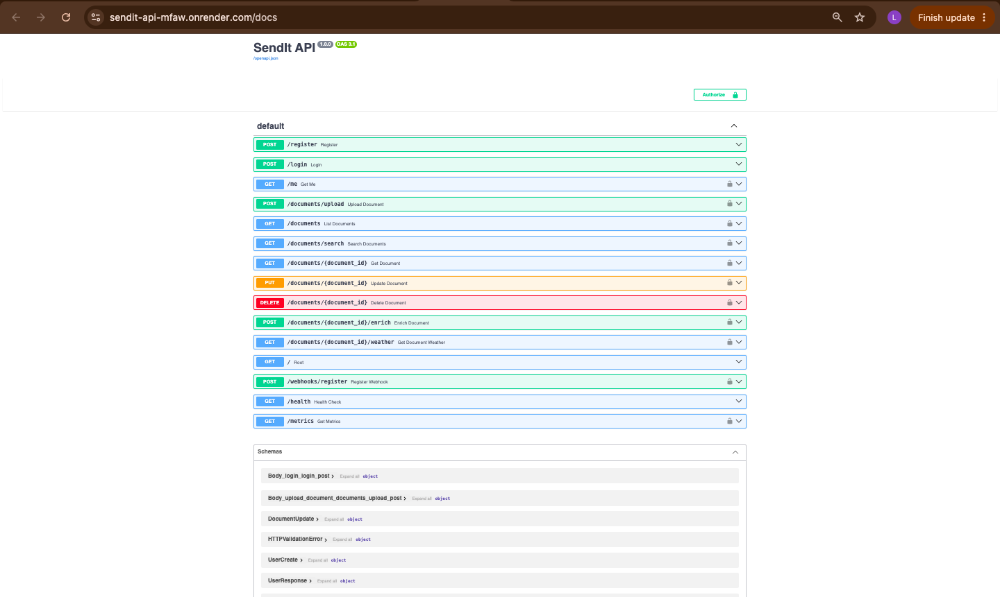

# SendIt – Document Management API

**Student Name:** Loise Maina
**Admission Number:** C027-01-0852/2024

## 1. Project Description

SendIt is a document management API developed using FastAPI. It allows a courier company to digitally upload, manage, search and enrich documents with weather information for specified locations.

The API provides secure access using authentication and role-based authorization.

## 2. Technologies Used

* Python
* FastAPI
* SQLModel
* PostgreSQL
* Docker
* JWT Authentication
* Open-Meteo Weather API
* SlowAPI for rate limiting
* Pytest
* Pytest-Cov
* Pytest-Benchmark
* Ruff
* Black
* GitHub Actions
* Render
* Uvicorn

## 3. Main Features

* User registration and login
* JWT-based authentication
* Role-based access for admin, manager and staff
* Document upload
* File type and file size validation
* Document versioning
* Document search and filtering
* Document update and deletion
* Weather data enrichment using Open-Meteo
* Manual weather enrichment
* Document status tracking
* Webhook registration
* API rate limiting
* Automated testing
* CI/CD pipeline
* Docker containerization
* Cloud deployment
* Health and monitoring endpoints
* Request logging

## 4. Project Structure

```text
sendit-api/
├── main.py
├── models/
│   ├── __init__.py
│   ├── user.py
│   └── document.py
├── database/
│   ├── __init__.py
│   └── session.py
├── services/
│   ├── __init__.py
│   └── weather.py
├── tests/
│   ├── __init__.py
│   ├── conftest.py
│   ├── test_auth.py
│   ├── test_documents.py
│   ├── test_errors.py
│   ├── test_integration.py
│   └── test_performance.py
├── .github/
│   └── workflows/
│       └── ci.yml
├── screenshots/
│   ├── sendit-api-screenshot.png
│   └── sendit-api-render-deployed.png
├── uploads/
├── auth.py
├── seeds.py
├── Dockerfile
├── requirements.txt
├── .env
├── docker-compose.yml
├── alembic.ini
├── pyproject.toml
└── README.md
```

### New components added in Lab 10

The Lab 10 structure introduced the `tests/` directory for automated testing, the `.github/workflows/` directory for GitHub Actions, a `Dockerfile` for containerization, and `requirements.txt` for deployment dependencies.

## 5. API Endpoints

| Method | Endpoint                           | Description                              |
| ------ | ---------------------------------- | ---------------------------------------- |
| POST   | `/register`                        | Register a new user                      |
| POST   | `/login`                           | Login and obtain an access token         |
| GET    | `/me`                              | Get current user                         |
| POST   | `/documents/upload`                | Upload a document                        |
| GET    | `/documents`                       | List documents                           |
| GET    | `/documents/search`                | Search documents using filters           |
| GET    | `/documents/{document_id}`         | Get one document                         |
| PUT    | `/documents/{document_id}`         | Update a document                        |
| DELETE | `/documents/{document_id}`         | Delete a document                        |
| POST   | `/documents/{document_id}/enrich`  | Manually enrich a document               |
| GET    | `/documents/{document_id}/weather` | Get weather information                  |
| POST   | `/webhooks/register`               | Register a webhook                       |
| GET    | `/health`                          | Health check and application information |
| GET    | `/metrics`                         | System metrics for administrators        |

## 6. File Upload Validation

The API accepts the following file types:

* PDF
* JPG
* JPEG
* PNG
* DOCX

The maximum upload size is **5 MB**.

Uploaded files are stored in the `uploads/` directory and a corresponding document record is stored in PostgreSQL.

## 7. Document Status

Documents can have different statuses during processing:

* `processing` – document is being processed
* `uploaded` – document has been uploaded successfully
* `enriched` – weather information has been successfully added
* `failed` – enrichment failed

## 8. Weather API Integration

SendIt uses the **Open-Meteo API** to obtain weather information based on the city and country provided during document upload.

The weather information is stored together with the document and can also be retrieved using the weather endpoint.

## 9. Role-Based Access

The API uses three user roles:

* **Admin:** Has full administrative access.
* **Manager:** Can manage and delete documents and perform enrichment.
* **Staff:** Can access and manage their own documents.

Managers and administrators can view documents belonging to all users, while staff members can only access their own documents.

## 10. Security

The API uses JWT authentication to protect authenticated endpoints. Passwords are hashed before being stored in the database.

Rate limiting is also implemented to reduce excessive requests to selected endpoints.

Sensitive environment variables such as the database URL and secret key are stored in `.env` and are not committed to GitHub.

## 11. Automated Testing

Lab 10 introduced automated testing using **pytest**.

The test suite covers:

* User registration
* User login
* Invalid login credentials
* Authentication requirements
* Document listing
* Document searching
* Document access control
* Error handling
* Integration testing
* Performance benchmarking

The final local test run produced:

```text
16 passed
```

Code coverage was:

```text
Total coverage: 67%
```

## 12. Code Quality

The project uses:

* **Ruff** for linting
* **Black** for code formatting

Final checks completed successfully:

```text
All checks passed!
14 files would be left unchanged.
```

## 13. CI/CD Pipeline

GitHub Actions was configured in:

```text
.github/workflows/ci.yml
```

The pipeline is designed to:

1. Install project dependencies.
2. Run automated tests.
3. Generate test coverage.
4. Run Ruff linting.
5. Run Black formatting checks.
6. Build the Docker image.
7. Prepare the project for deployment.

The workflow runs automatically through GitHub when changes are pushed to the repository.

## 14. Docker Deployment

A `Dockerfile` was created to containerize the SendIt API.

The application runs using:

```text
uvicorn main:app --host 0.0.0.0 --port ${PORT:-10000}
```

The container exposes port `10000`, allowing the application to run correctly on Render.

## 15. Cloud Deployment

The SendIt API was successfully deployed to **Render**.

### Live API

https://sendit-api-mfaw.onrender.com

### Swagger Documentation

https://sendit-api-mfaw.onrender.com/docs

The deployed application successfully connected to PostgreSQL, created the required database tables and returned a successful response from the root endpoint.

Example:

```text
GET /
200 OK
```

Render confirmed:

```text
Your service is live
```

## 16. Monitoring

A health monitoring endpoint was added:

```text
GET /health
```

It reports application health, timestamp, version, uptime, operating system and Python version.

An administrator-only metrics endpoint was also added:

```text
GET /metrics
```

It provides:

* CPU usage
* Memory usage
* Disk usage

## 17. Logging

Request logging was implemented using Python's `logging` module.

The application records:

* HTTP method
* Request path
* Response status code
* Request processing time

Rotating file logging is used to prevent the log file from growing indefinitely.

## 18. API Screenshots

### Swagger UI


### Render Deployment



## 19. GitHub Repository

GitHub repository:

https://github.com/loise-maina304/sendit-api

## 20. Conclusion

The SendIt API provides a secure document management system that supports file uploads, validation, document tracking, versioning, searching and external weather-data enrichment.

Lab 10 extended the project by adding automated testing, performance benchmarking, code-quality checks, GitHub Actions CI/CD, Docker containerization, cloud deployment on Render, monitoring and logging.

The completed project demonstrates the practical use of FastAPI, PostgreSQL, SQLModel, JWT authentication, external APIs, role-based authorization, automated testing, CI/CD and cloud deployment.
